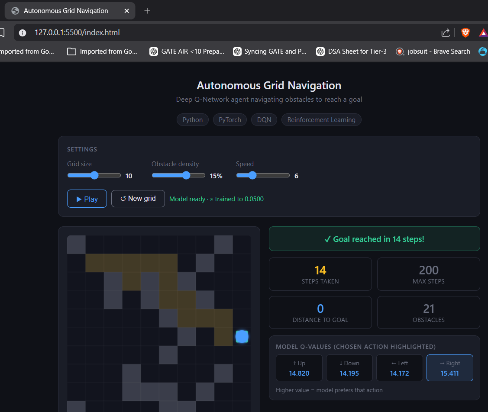
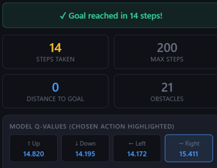
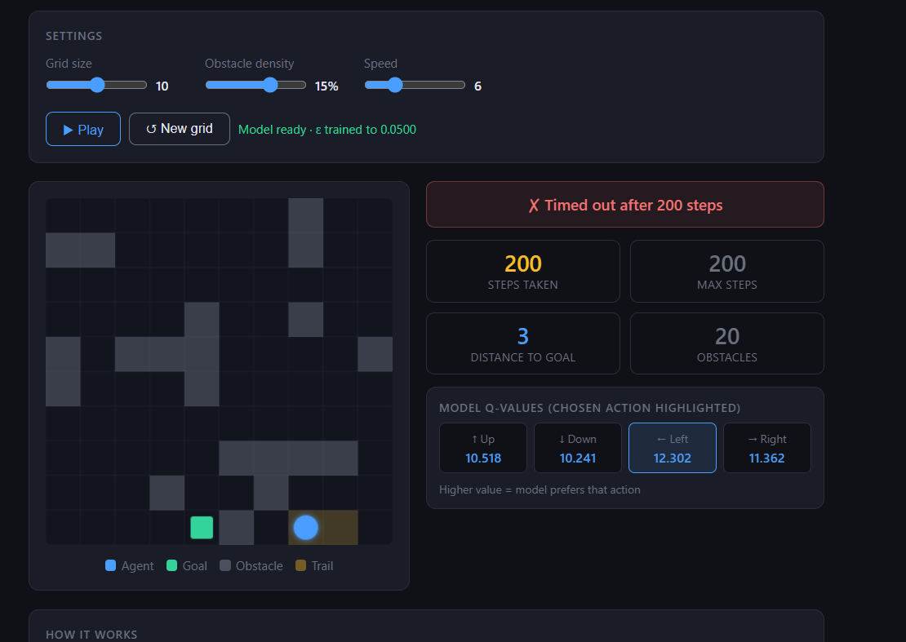
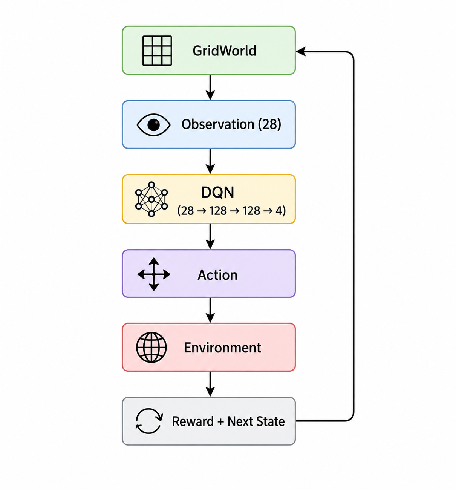

# Reinforcement Learning Based Autonomous Grid Navigation Under Limited Perception

## Overview

This project implements an autonomous navigation agent using Deep Q-Networks (DQN) in a partially observable grid environment. The agent must learn to navigate from a random start position to a goal position while avoiding obstacles.

Unlike traditional path planning algorithms, the agent only observes a local 5×5 region around itself and learns through interaction with the environment.

---

## Demo

### Browser Visualizer

### Successful Navigation

### Timeout / Failure Case

---

## Problem Statement

Design an autonomous navigation agent capable of reaching a target location in a partially observable environment using reinforcement learning.

Constraints:

* Limited perception
* Unknown obstacle locations
* Dynamic start and goal positions
* Sparse environmental information

---

## Environment

| Parameter          | Value   |
| ------------------ | ------- |
| Grid Size          | 10 × 10 |
| Observation Window | 5 × 5   |
| Obstacle Density   | 20%     |
| Maximum Steps      | 200     |

A BFS validation step ensures that every generated environment contains at least one valid path from the start location to the goal.

---

## Observation Space

The agent receives:

* 5 × 5 local observation window (25 values)
* Relative goal direction `(goal_dx, goal_dy)`
* Previous action

Total State Dimension:

28

---

## Action Space

| Action | Description |
| ------ | ----------- |
| 0      | Up          |
| 1      | Down        |
| 2      | Left        |
| 3      | Right       |

---

## DQN Architecture

Network:

28 → 128 → 128 → 4

* Fully Connected Layer (128)
* ReLU
* Fully Connected Layer (128)
* ReLU
* Output Layer (4 Q-values)

### Architecture Diagram

---

## Reward Function

| Event        | Reward |
| ------------ | ------ |
| Reach Goal   | +15    |
| Timeout      | -1     |
| Step Cost    | -0.15  |
| Move Closer  | +0.08  |
| Move Away    | -0.01  |
| Hit Obstacle | -5     |
| Invalid Move | -1     |
| Revisit Cell | -0.05  |

---

## Training Components

* Deep Q-Network (DQN)
* Experience Replay Buffer
* Target Network
* Epsilon-Greedy Exploration
* Bellman Update
* Huber Loss (SmoothL1Loss)
* Adam Optimizer

---

## Results

Evaluation over 100 unseen episodes:

| Metric           | Value   |
| ---------------- | ------- |
| Success Rate     | 89%     |
| Grid Size        | 10 × 10 |
| Obstacle Density | 20%     |
| Maximum Steps    | 200     |

---

## Browser Deployment

The trained PyTorch model is exported to JSON format and executed directly inside the browser using JavaScript.

Pipeline:

Training (PyTorch)
↓
model.pth
↓
export_weights.py
↓
weights.json
↓
Browser Inference

No backend server is required.

---

## Limitations

The environment is partially observable. Since the DQN uses a feedforward neural network, it does not maintain memory of previously visited states. This can occasionally cause loops or failure in complex environments.

---

## Future Work

* Double DQN
* Dueling DQN
* Prioritized Experience Replay
* LSTM-based DQN (DRQN)
* Dynamic Obstacles
* Multi-Agent Navigation

---

## Author

Vivek Bhushan
Tanmay Hajela

Minor Project 2

Autonomous Grid Navigation using Reinforcement Learning